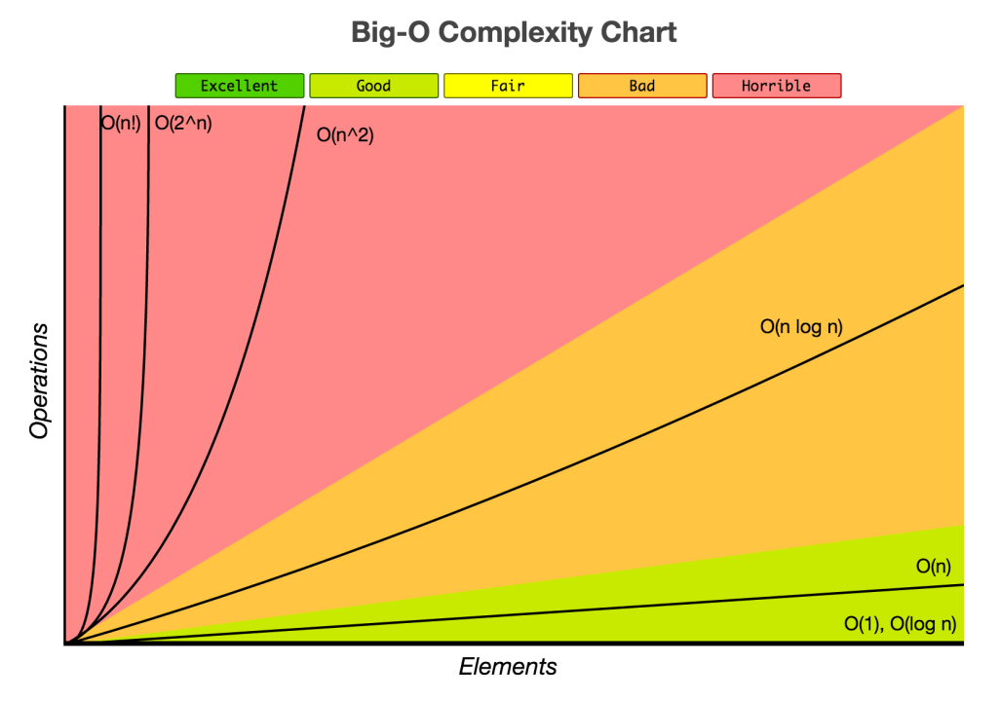

# Data Structure and Algorithms

This repo is my learnings on refreshing of Data Structure and Algosrithms concepts based on the course from Udemy.

[Master the Coding Interview: Data Structures + Algorith](https://www.udemy.com/course/master-the-coding-interview-data-structures-algorithms/?srsltid=AfmBOoqnxPV2W_jALvtfNAfrjwOT_dX1rT2TtxBOjr77BTbAHQWf71O7)

All the code are in Python 

